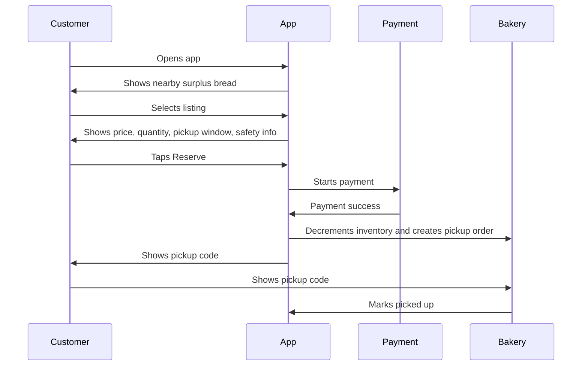
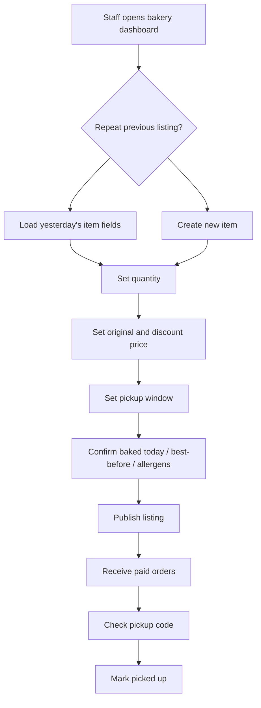

---

status: draft

last_reviewed: 2026-06-21

owner: Bryan

project: BreadSaver

scope: MVP scope, user journeys, screens, requirements, business rules, UX, and first screen

---

# BreadSaver MVP Product Spec

<!-- Lossless split from former 2026-06-21-breadsaver-requirements-and-goals.md. Original section text preserved verbatim in this folder. -->

## Overbuild Audit

This is the actual cut for the first demo. The goal is not to build every food-waste app category. The goal is to make one tight marketplace loop feel real.

### Must Build Now

- Customer can browse nearby surplus bakery listings.
- Customer can filter by bread, pastry, bundle, pickup soon, and under RM10.
- Customer can switch between list and simple map view.
- Customer can open a listing and see photo, bakery, distance, pickup window, quantity, old price, new price, discount, ingredients, and allergens.
- Customer can reserve with simulated payment.
- App decrements inventory immediately after reservation.
- Customer receives a paid pickup receipt with code, address, phone, pickup window, item, and savings.
- Bakery can create a listing quickly.
- Bakery can see paid pickup queue and mark orders picked up.
- Empty, sold-out, and pickup-complete states exist.

### Cut From V1

- Admin dashboard.
- Full dispute/refund system.
- Buyer-seller chat.
- Community feed.
- Recipes.
- Volunteer rescue.
- Non-food donations.
- Loyalty program.
- Real payment processor.
- Real auth.
- Real map provider.
- Ratings/reviews.
- Favorites/watchlist.
- AI-generated listing copy.
- Push notifications.

### Why These Are Cut

They do not answer the first validation question: can one bakery list surplus bread and can one nearby buyer reserve it with confidence?

Anything that does not improve that loop is parked.

## Non-Goals

For MVP, do not build:
- delivery
- full restaurant marketplace
- grocery inventory scanning
- loyalty program
- subscription
- dynamic ML pricing
- complex delivery logistics
- nutrition tracking
- social feed
- charity donation flow
- volunteer rescue operations
- non-food donation marketplace
- open buyer-seller chat
- recipe/community forum

These are distractions until the reservation/pickup loop works.

## Core User Journeys

### Journey 1: Customer Buys Bread



### Journey 2: Bakery Lists Bread



### Journey 3: Failed Pickup

```text
Customer pays -> does not arrive before pickup window ends -> order becomes missed_pickup.

Policy options:
1. No refund by default, because bakery held inventory.
2. Bakery/admin can issue goodwill refund.
3. Repeat no-shows may be blocked from reserving without upfront payment.
```

## Required Screens

### Customer Screens

1. **Home / Browse**
   - primary screen, not a landing page
   - shows available bread near the user
   - search by bakery or bread type
   - list/map toggle
   - current location or manual location selector
   - radius selector
   - sections: Nearby available now, Pickup soon, Best value, Saved bakeries
   - filters: pickup time, distance, price, bakery, vegetarian/halal/allergen notes if applicable
   - quick chips: All, Bread, Pastries, Bundles, Under RM10, Pickup now

2. **Listing Detail**
   - item photo
   - favorite/watchlist action
   - share action
   - bakery name and distance
   - pickup window
   - quantity left
   - original price and discounted price
   - discount percent
   - what you could get / exact item list
   - safety and allergen notes
   - bakery rating and pickup reliability
   - report listing action
   - reserve CTA

3. **Checkout**
   - order summary
   - pickup warning
   - payment method
   - final confirm

4. **Order Confirmation**
   - paid status
   - pickup code
   - order reference
   - map/directions button
   - store address and phone
   - pickup window countdown
   - item summary and total savings
   - cancel/refund policy

5. **Orders**
   - active pickup
   - completed orders
   - missed pickups

6. **Trust / FAQ**
   - what surplus bread means
   - why pickup windows exist
   - what "best before" means
   - allergen responsibility
   - refund/no-show policy

### Bakery Screens

1. **Bakery Dashboard**
   - today's sales
   - active listings
   - upcoming pickups
   - sold-out and expired listings

2. **Create Listing**
   - fast listing form
   - photo-first creation
   - repeat previous listing
   - SKU/item presets
   - optional "AI draft title/description from photo" after core flow works
   - quantity stepper
   - discount price
   - original price
   - discount percent preview
   - pickup window
   - approximate location defaults to bakery address
   - safety confirmation

3. **Pickup Queue**
   - order code
   - customer initials or name
   - item count
   - pickup status
   - mark picked up / no-show

4. **Listing History**
   - what sold
   - what expired unsold
   - estimated waste avoided
   - recovered revenue

### Admin Screens

1. **Bakery Approval**
   - approve/reject bakery
   - basic food license/business info field if required locally
   - safety policy acknowledgement

2. **Disputes**
   - refund queue
   - failed pickup reports
   - unsafe listing reports

3. **Marketplace Health**
   - active bakeries
   - sell-through rate
   - failed pickup rate
   - repeat customer rate

## Functional Requirements

### Listings

| ID | Requirement | Priority |
|---|---|---|
| FR-001 | Bakery can create a listing with title, category, quantity, discounted price, pickup window, and safety confirmation. | P0 |
| FR-002 | Bakery can upload or select a photo. | P1 |
| FR-003 | Bakery can duplicate yesterday's listing. | P0 |
| FR-004 | Listing automatically becomes unavailable when quantity reaches zero. | P0 |
| FR-005 | Listing automatically expires after pickup window ends. | P0 |
| FR-006 | Bakery can pause or mark sold out manually. | P0 |
| FR-007 | Customer can filter by pickup time, distance, and price. | P1 |
| FR-008 | Customer can switch between list view and map view. | P1 |
| FR-009 | Customer can favorite bakeries or listings and view saved items. | P1 |
| FR-010 | Listing card shows old price, new price, discount percent, quantity left, and pickup window. | P0 |

### Orders

| ID | Requirement | Priority |
|---|---|---|
| FR-101 | Customer can reserve and pay for available quantity. | P0 |
| FR-102 | System prevents overselling when multiple users buy the same listing. | P0 |
| FR-103 | Successful payment creates an order and decrements available quantity. | P0 |
| FR-104 | Order confirmation shows pickup code and pickup window. | P0 |
| FR-105 | Bakery can mark order as picked up after checking code. | P0 |
| FR-106 | Order becomes missed_pickup if not collected by pickup window end. | P1 |
| FR-107 | Customer can request refund from order detail. | P1 |
| FR-108 | Order confirmation shows paid status, pickup code, map, phone, item summary, and savings. | P0 |
| FR-109 | Customer can cancel before a configured cutoff if the product supports refunds. | P2 |

### Payments

| ID | Requirement | Priority |
|---|---|---|
| FR-201 | MVP may use simulated payment for demo. | P0 |
| FR-202 | Production must support card or e-wallet payment before inventory is held. | P0 |
| FR-203 | Refunds must be traceable to an order. | P1 |
| FR-204 | Platform fee must be configurable. | P2 |

### Trust And Safety

| ID | Requirement | Priority |
|---|---|---|
| FR-301 | Bakery must confirm every listing is safe to sell. | P0 |
| FR-302 | Listing must show pickup deadline. | P0 |
| FR-303 | Listing must support allergen notes. | P0 |
| FR-304 | App must avoid "expired" wording in customer UI. | P0 |
| FR-305 | Admin can remove unsafe or reported listings. | P1 |
| FR-306 | Bakery policy page explains date labels, pickup responsibility, and refund rules. | P1 |
| FR-307 | Bakery listing form must include ingredients/allergen field for mixed or surprise bundles. | P1 |
| FR-308 | Customer can report a listing, bakery, or fulfilled order. | P1 |
| FR-309 | Customer-facing listing detail includes bakery rating or trust metadata. | P1 |
| FR-310 | App includes a short pickup code/code-of-conduct policy: be on time, show code, contact support if late. | P1 |

### Location

| ID | Requirement | Priority |
|---|---|---|
| FR-401 | Customer can browse by current location or chosen area. | P0 |
| FR-402 | Listing card shows distance or area. | P1 |
| FR-403 | Order confirmation has directions link. | P0 |
| FR-404 | MVP can use static bakery coordinates. | P0 |
| FR-405 | Customer can set a radius or choose a neighborhood manually if location permission is denied. | P1 |
| FR-406 | Map pins cluster or summarize listings when many bakeries are nearby. | P2 |

## Business Logic Rules

| Rule ID | Rule | Outcome |
|---|---|---|
| BR-001 | Listing quantity must be greater than zero to publish. | Reject listing if invalid. |
| BR-002 | Pickup window end must be in the future. | Reject listing if invalid. |
| BR-003 | Customer cannot buy more than available quantity. | Reject order or reduce selectable quantity. |
| BR-004 | Payment success is required before inventory is held in production. | Prevent unpaid holds from blocking real buyers. |
| BR-005 | On successful purchase, available quantity decreases atomically. | Prevent overselling. |
| BR-006 | Listing becomes sold_out when available quantity reaches zero. | Hide reserve CTA. |
| BR-007 | Listing becomes expired when pickup window end passes. | Hide listing from browse. |
| BR-008 | Order can be picked_up only by bakery staff or admin. | Protect pickup proof. |
| BR-009 | Picked-up orders cannot be refunded automatically. | Manual dispute only. |
| BR-010 | Missed pickup after customer no-show is not automatically refunded by default. | Bakery was holding perishable inventory. |
| BR-011 | Listings must include a safety confirmation. | No confirmation, no publish. |
| BR-012 | Customer UI must say surplus/near-expiry/end-of-day, not expired. | Preserve trust. |
| BR-013 | If location permission is denied, customer must still be able to choose an area manually. | Avoid dead-end onboarding. |
| BR-014 | A listing with an allergen-sensitive bundle must show allergen notes before checkout. | Prevent trust and safety failures. |
| BR-015 | Customer can only redeem with a live order code, not a screenshot-only flow in production. | Reduce pickup fraud. |
| BR-016 | A report on a listing hides or flags it for admin review depending on severity. | Keep unsafe supply out. |


## UX Principles

From `stackifier-v5-landing/.windsurf/rules/ui.md`:

- User must understand the app in 3 seconds.
- Show the actual product surface immediately.
- Avoid generic gradient-heavy AI styling.
- Keep visual hierarchy clear.
- CTA must be obvious and functional.

Additional product-specific UX rules:

- The first screen is the bread marketplace, not a marketing hero.
- Mobile-first. Most purchases happen on the move.
- Use food photography or realistic item cards, not abstract illustrations.
- Keep cards compact: item, bakery, pickup window, price, quantity, reserve.
- Use urgency carefully. "Pickup by 7:30 PM" is better than fake hype.
- Use trust language near the CTA: "Baked today. Pickup only. Allergen notes included."
- Do not hide pickup window or quantity behind a modal.
- Use calmer typography than the screenshot references. A food trust app can be fun, but it cannot look unserious.
- Avoid decorative food cutouts around the interface. Real listing photography should carry the visual system.
- Use badges only when they answer a buying question: Paid, 1 left, pickup today, -50%, favorite bakery.
- If using a map, keep it functional. Search, list/map toggle, radius, and selected listing preview must work.

## Mobile Requirements

Mobile users are likely walking, commuting, or deciding quickly.

Required:
- touch targets at least 44px
- reserve CTA reachable near thumb zone
- no hover-only interactions
- bottom sheets for filters/details on mobile
- sticky order confirmation summary during checkout
- explicit loading and error states
- app remains usable on slow network
- manual location fallback when permission is denied
- no bottom nav that collides with browser controls on mobile web
- dense listing cards that still preserve readable price, pickup window, and quantity

MFRI estimate:
- Platform clarity: 4, mobile web first
- Accessibility readiness: 3
- Interaction complexity: 3
- Performance risk: 2
- Offline dependence: 1
- Score: 1

Result: risky unless we keep interactions simple. Do not overbuild map, chat, or heavy animations in MVP.


## Recommended First Screen

Do not start with a hero section.

Start with:

```text
Top bar:
  BreadSaver | Current area | Bakery login

Main:
  "Discounted bread near you"
  Location selector
  List / Map toggle
  Filter chips: Pickup now, Under RM10, Bundles, Bread, Pastries, Baked today

Listing cards:
  [photo] Sourdough bundle
  Sunrise Bakery, 600m
  Pickup 6:30-8:00 PM
  RM6, was RM14, -57%
  3 left | Baked today | 4.8 rating
  [Reserve]

Secondary:
  Active order receipt or empty state
```
