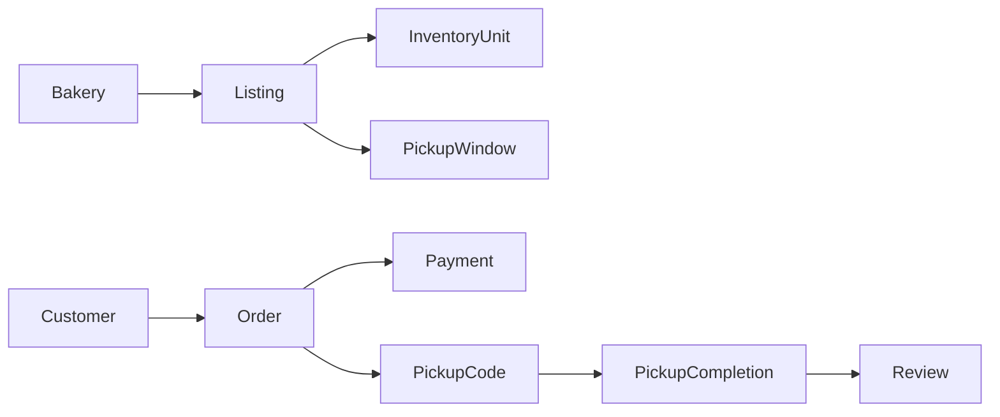

---

status: draft

last_reviewed: 2026-06-21

owner: Bryan

project: BreadSaver

scope: Positioning, primitives, segments, goals, and pricing

---

# BreadSaver Product Brief

<!-- Lossless split from former 2026-06-21-breadsaver-requirements-and-goals.md. Original section text preserved verbatim in this folder. -->

## Core Positioning

Do not position this as "expired bread."

Use:
- surplus bread
- near-expiry bread
- end-of-day bread
- still-good bakery items
- discounted pickup bundles

Avoid:
- expired bread
- old bread
- leftover trash
- random food waste

The product works only if users trust the food and bakeries feel proud to list it.

## First-Principles Logic

### Primitive Objects



### Primitive Exchange

```text
Bakery has surplus bread with limited sale time.
Customer wants cheaper bread without wasting a trip.
Platform creates certainty:
  - what is available
  - how much it costs
  - when it can be collected
  - whether it is reserved
  - whether payment is complete
```

### Why This Beats Walking In

Walking in has uncertainty:
- the bread may be sold out
- the discount may be unclear
- the customer may arrive too early or too late
- the bakery may not hold anything

BreadSaver wins only if it gives certainty:
- reserved inventory
- visible discount
- fixed pickup window
- prepaid order
- pickup code proof


## Customer Segments

### Primary Customer: Nearby Buyer

Examples:
- student
- office worker
- nearby resident
- budget-conscious family buyer

Job:
- find cheaper bread today
- reserve it before making the trip
- pick it up quickly

Pain:
- paying full price for bread that will be consumed soon anyway
- walking into a bakery and finding the deal gone
- not knowing whether discounted bread is safe or fresh enough

Success:
- buys discounted bread in under 90 seconds
- knows exactly where and when to collect
- feels safe eating it

### Primary Supply User: Bakery Staff

Examples:
- owner-operator
- outlet manager
- cashier closing the store
- production lead

Job:
- clear surplus bread before close
- reduce wastage
- recover some revenue
- bring customers into the store

Pain:
- throwing away unsold bread
- discounting manually with no demand visibility
- posting in WhatsApp/Instagram with no reservation logic
- staff do not have time to manage complex listings

Success:
- lists surplus in under 30 seconds
- sells more end-of-day inventory
- sees pickup orders without extra admin mess

### Platform Admin

Job:
- approve bakeries
- prevent unsafe listings
- resolve disputes/refunds
- track marketplace health

Success:
- fewer bad listings
- fewer failed pickups
- repeat purchase rate improves

## Product Goals

### G1. Create Reservation Certainty

The app must remove the main reason users do not bother: "what if I go there and there is nothing?"

Required:
- live quantity
- reservation hold
- paid order
- pickup code
- sold-out state
- pickup time enforcement
- directions and store phone after purchase

### G2. Make Bakery Listing Faster Than Posting Manually

The bakery flow must be faster than:
- taking a photo
- writing a social post
- replying to DMs
- tracking who reserved what

Required:
- repeat previous listing
- quick quantity stepper
- preset pickup windows
- default discount suggestions
- one-tap sold-out

### G3. Make Trust Obvious

Customers must understand this is still-safe surplus, not unsafe expired food.

Required:
- clear "best before" or "baked today" context
- allergen field
- bakery verification status
- pickup deadline
- refund policy
- bakery rating and basic profile
- report listing flow
- pickup code instead of open-ended messaging

### G4. Build A Pitch-Ready Working Demo

The first build should show a complete marketplace loop.

Required:
- customer browse
- list/map toggle
- location/radius selector
- listing detail
- checkout/reservation
- order confirmation
- bakery dashboard
- listing creation
- pickup completion

### G5. Validate The Business, Not Just The App

The product is not validated by a pretty UI. It is validated when a bakery agrees to list real surplus and customers reserve it.

Required validation artifacts:
- 3 bakery interviews
- 1 bakery willing to test
- 10 real customer intent signals
- 1 live or simulated end-of-day listing run


## Pricing And Marketplace Model

### MVP Pricing

Use simple fixed discounts:
- 30% off for same-day surplus
- 50% off for final pickup window
- bundle pricing for mixed bread bags

### Revenue Options

| Model | Pros | Cons | MVP Recommendation |
|---|---|---|---|
| Take rate per order | Aligns with sales | Needs payments and accounting | Good after demo |
| Bakery subscription | Predictable | Hard before proven demand | Not MVP |
| Listing fee | Simple | Punishes bakeries before sale | Avoid |
| Sponsored placement | Monetizable later | Bad trust early | Not MVP |

Recommended MVP:
- demo with simulated platform fee
- production target: small take rate per successful order
