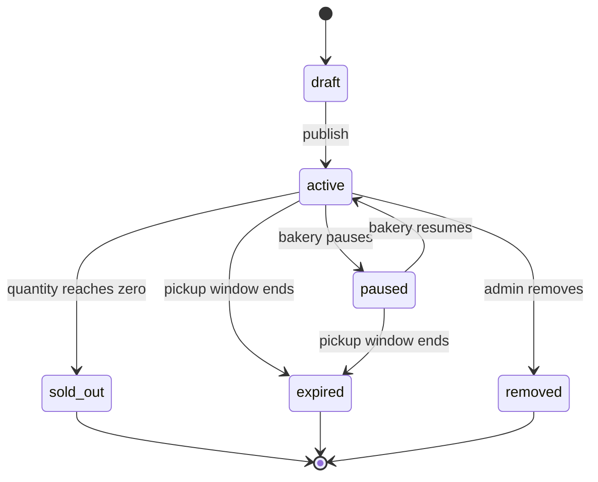
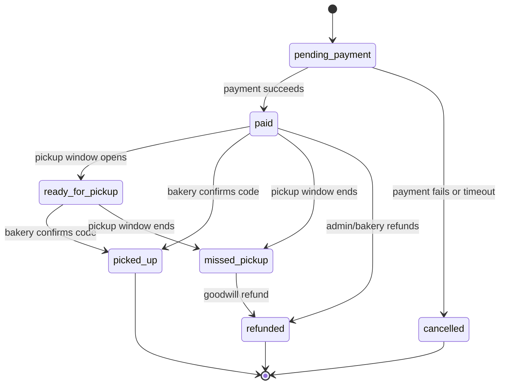

---

status: draft

last_reviewed: 2026-06-21

owner: Bryan

project: BreadSaver

scope: Data model and lifecycle state machines

---

# BreadSaver Technical Contract

<!-- Lossless split from former 2026-06-21-breadsaver-requirements-and-goals.md. Original section text preserved verbatim in this folder. -->

## Data Model

```ts
type ListingStatus = "draft" | "active" | "paused" | "sold_out" | "expired" | "removed";
type OrderStatus = "pending_payment" | "paid" | "ready_for_pickup" | "picked_up" | "missed_pickup" | "refunded" | "cancelled";
type BakeryStatus = "pending_review" | "approved" | "suspended";

interface Bakery {
  id: string;
  name: string;
  status: BakeryStatus;
  address: string;
  latitude: number;
  longitude: number;
  phone?: string;
  openingHours?: string;
  ratingAverage?: number;
  ratingCount?: number;
  pickupSuccessRate?: number;
  safetyAcknowledgedAt?: string;
}

interface Listing {
  id: string;
  bakeryId: string;
  title: string;
  category: "loaf" | "bun" | "pastry" | "cake" | "bundle" | "other";
  description?: string;
  photoUrl?: string;
  originalPriceCents?: number;
  discountedPriceCents: number;
  discountPercent?: number;
  currency: "MYR" | "USD" | "SGD";
  quantityTotal: number;
  quantityAvailable: number;
  pickupStartAt: string;
  pickupEndAt: string;
  bakedAt?: string;
  bestBeforeAt?: string;
  allergenNotes?: string;
  ingredientsNotes?: string;
  safetyConfirmedAt: string;
  reportCount?: number;
  favoriteCount?: number;
  status: ListingStatus;
  createdAt: string;
  updatedAt: string;
}

interface Order {
  id: string;
  listingId: string;
  bakeryId: string;
  customerId: string;
  quantity: number;
  totalPaidCents: number;
  currency: "MYR" | "USD" | "SGD";
  status: OrderStatus;
  pickupCode: string;
  paymentReference?: string;
  paidAt?: string;
  pickedUpAt?: string;
  createdAt: string;
}

interface Report {
  id: string;
  targetType: "listing" | "bakery" | "order";
  targetId: string;
  reason: "unsafe_food" | "wrong_item" | "closed_store" | "no_inventory" | "rude_pickup" | "other";
  details?: string;
  createdAt: string;
}
```

## State Machines

### Listing State



### Order State


